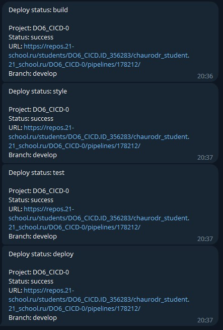

## Part 1. Настройка gitlab-runner  
#### Поднимаем виртуальную машину  
  

#### Скачиваем и устанавливаем gitlab-runner  
  
Получаем ошибку 0000, которая показана на следующем скриншоте и переустаналиваем gitlab-runner с использованием команд:  
`sudo curl -L --output /usr/local/bin/gitlab-runner "https://gitlab-runner-downloads.s3.amazonaws.com/latest/binaries/gitlab-runner-linux-amd64"`

`sudo chmod +x /usr/local/bin/gitlab-runner`

`sudo useradd --comment 'GitLab Runner' --create-home gitlab-runner --shell /bin/bash`

`sudo gitlab-runner install --user=gitlab-runner --working-directory=/home/gitlab-runner`

`sudo gitlab-runner start`

`sudo systemctl enable --now gitlab-runner`

#### Регистрируем gitlab-runner  
  

## Part 2. Сборка  

#### Создаём файл `.gitlab-ci.yml` в корне проекта и вписываем туда следующее:  

  

#### Докидываем `s21_cat` и `s21_grep` из проекта `SimpleBash`, пушим и проверяем работу:  

  

## Part 3. Тест кодстайла  
#### Не забываем дописать этап в начало `.gitlab-ci.yml`  
  

#### Дописываем стадию кодстайла:  
  

#### Пушим, проверяем:  

  

#### Теперь добавим ошибки по кодстайлу в файлы, запушим и посмотрим результат:  

  

#### Посмотрим на пайплайн:  

  
Всё как надо.  

## Part 4. Интеграционные тесты  
#### Добавим этап в начало `.gitlab-ci.yml`  
  

#### Допишем стадию:  
  

#### Содержимое скрипта test.sh:  
  

#### Пушим, смотрим результат:  
  

#### Пайплайн выполнен успешно:  
  

#### Немного поломаем cat, чтобы проверить фейл:  
  

#### Пайплайн успешно зафейлен:  
  

#### Протестируем скип работы при фейле предыдущих:  
  

## Part 5. Этап деплоя  
#### Поднимаем вторую машину:  
  

#### Изменяем файл /etc/netplan/00-installer-config.yaml на обеих машинах:  
  

#### Изменяем настройки адаптеров:  
  

#### Пропингуем вторую машину с первой, чтобы убедиться, что соединение есть:  
  

#### Добавим этап в начало `.gitlab-ci.yml`  
  

#### Допишем стадию:  
  

#### Содержимое скрипта deploy.sh:  
  

#### Далее зайдём из-под пользователя gitlab-runner предварительно задав пароль командой `sudo passwd gitlab-runner`  
#### Затем добавим пользователя gitlab-runner в группу sudoers
#### Далее сгенерируем ssh ключ командой `ssh-keygen` и скопируем его на вторую машину командой `ssh-copy-id chaurodr@10.10.0.2`  
#### Теперь мы можем подключаться ко второй машине через ssh без необходимости ввода пароля:  
  

#### На второй машине дадим права для папки `/usr/local/bin/` командой `sudo chmod -R 777 /usr/local/bin`  

#### После пуша стадия деплой ждёт ручного запуска:  
  

#### Деплой прошёл успешно, файлы появились в нужной папке на второй машине:  
  

## Part 6. Дополнительно. Уведомления  

#### Напишем @botfather, чтобы создать бота и получить его токен:
  

#### Добавим по вызову скрипта `notify.sh` после каждой стадии:
  

#### Содержимое скрипта `notify.sh`:  
  

#### Пушим, проверяем работу:  
  

